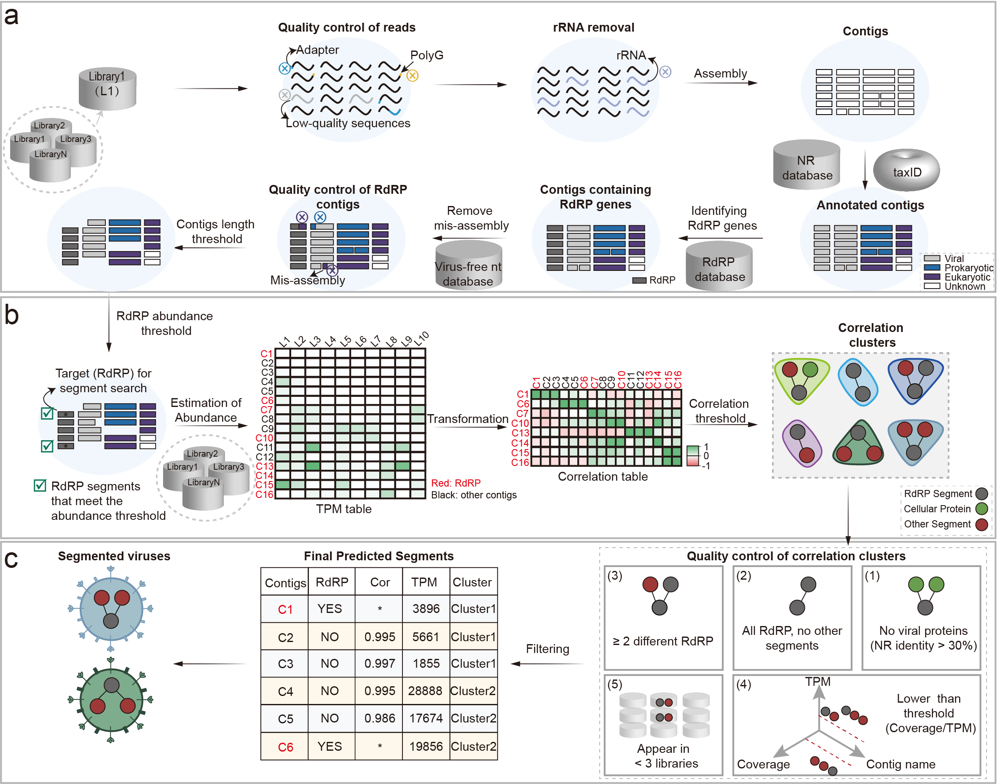

# SegFinder   
**SegFinder** is a correlation-based approach that enhances load similarity and co-occurrence methods to **detect new genomic segments of RNA viruses** by analyzing abundance patterns and their correlations across samples.

## 1. segmented virus finder workflow  

<center>

SegFinder detection pipeline. a, Schematic overview of the discovery of RdRP for RNA viruses. The inputs are fastq files for multiple meta-transcriptome libraries. rRNA, ribosomal RNA; NR, Non-Redundant Protein Sequence Database; NT, Nucleotide Sequence Database. b, The processing pipeline of correlation calculation. L, library; C, contig; c, Schematic illustration of filtering of segmented RNA virus clusters. Cor, correlation; TPM, Transcripts Per Kilobase of exon model per Million mapped reads.


## 2. Environment Installation

Our recommendation is for users to clone our stable `main` branch directly and designate `SegFinder` as the working directory. The setup for SegFinder can be done as follows.

### step1: Update git and clone repository
#### 1) centos
```shell
sudo yum update
sudo yum install sqlite sqlite-devel git-all
```
#### 2) ubuntu
```shell
sudo apt-get update
sudo apt install sqlite3 libsqlite3-dev git-all 
```
#### 3) Clone repository to the current directory
```shell
git clone https://github.com/Kongloner/SegFinder.git
```
### step2: Install conda and necessary tools
#### 1) Download anaconda3
```shell
wget https://repo.anaconda.com/archive/Anaconda3-2022.05-Linux-x86_64.sh
```
#### 2) Install conda
```shell
sh Anaconda3-2022.05-Linux-x86_64.sh
##### Notice: Select Yes to update ~/.bashrc
```
```shell
source ~/.bashrc
```
#### 3) Create a virtual environment: python=3.9.13
```shell
conda create -n SegFinder python=3.9.13
```

#### 4) Activate SegFinder and install necessary tools 
```shell
conda activate SegFinder   
conda install -c bioconda fastp blast seqkit seqtk megahit cd-hit ribodetector salmon spades bowtie2
conda install diamond==2.0.15
``` 

### step3: Install R and R package  
- R>=4.2

The first step is to install [**R software**](https://www.r-project.org/). Once this is done, several packages  have to be installed too. To do so start a R session and type :
```shell
# Some users can accelerate by mirror
# options(BioC_mirror="https://mirrors.tuna.tsinghua.edu.cn/bioconductor/")
# options("repos" = c(CRAN="http://mirrors.cloud.tencent.com/CRAN/"))
```
```shell
# install packages from CRAN
cran.packages <- c("BiocManager", "abind", "argparse", "openxlsx", "data.table", "doParallel", "dplyr", "foreach", "magrittr", "stringr", "tidyr", "Matrix", "igraph")

for (pkg in cran.packages) {
  if (!requireNamespace(pkg, quietly = TRUE)) {
    install.packages(pkg, ask = F, update = F)
  }
}
```
```shell
# install packages from Bioconductor
bioconductor.packages <- c("GenomeInfoDbData", "Biostrings")

for (pkg in bioconductor.packages) {
    if (!requireNamespace(pkg, quietly = TRUE)) {
        BiocManager::install(pkg, ask = F, update = F)
    }
}
```

### step4: Downloading and configuring the database

#### 1) accession2taxid
```shell
#Download the `PROT_ACC2TAXID` file
wget -c https://ftp.ncbi.nlm.nih.gov/pub/taxonomy/accession2taxid/prot.accession2taxid.gz
wget -c https://ftp.ncbi.nlm.nih.gov/pub/taxonomy/accession2taxid/prot.accession2taxid.gz.md5

#Check for the file integrity
md5sum -c prot.accession2taxid.gz.md5

#Unzip the files and onfiguration
gunzip -c prot.accession2taxid.gz > accession2taxid/prot.accession2taxid
```
#### 2) [NCBI Non-Redundant Protein Database (NR)](./flow/db_NR.md)
#### 3) [NCBI Nucleotide Sequence Database (NT)](./flow/db_NT.md)
#### 4) [Virus-free non-redundant nucleotide (virus-free nt)](./flow/db_nt_noViruses.md)


### Using    

```./SegFinder.sh [option] --help``` for **help**
Assuming all databases are stored in the SegDB folder in the current working directory.
#### Step 1: discovery of RdRP for RNA viruses  
```shell
./SegFinder.sh --indata testdata \
               --taxidDB Seg_DB/accession2taxid/prot.accession2taxid \
               --nt_noViruses Seg_DB/NT/nt_noViruses \
               --nt Seg_DB/NT/nt \
               --thread 20 \
               --datatype 2 \
               --method salmon \
               --preprocess true  \
               --assemble megahit  \
               --nr Seg_DB/NR/nr \
               --only_rdrp_find 1
```

#### Step 2: segmented RNA virus finder        
```shell
./SegFinder.sh --indata testdata \
               --taxidDB Seg_DB/accession2taxid/prot.accession2taxid \
               --nt_noViruses Seg_DB/NT/nt_noViruses \
               --nt Seg_DB/nt  \
               --thread 20 \
               --rm_length 600 \
               --datatype 2 \
               --cor 0.8 \
               --library_ID $file \
               --method salmon  \
               --nr Seg_DB/nr
``` 


## Cite this article
Xue Liu#,1, Jianbin Kong#,1, Yongtao Shan1, Ziyue Yang1, Jiafan Miao1, Name61, Name71, Name81, Name91, Name101, Name111, Name121, Name131, Name14*, Name15*. SegFinder: Segment RNA virus discovery based on correlation in multiple libraries. ----------; doi: -------------------  
\# equally contributed    

  
